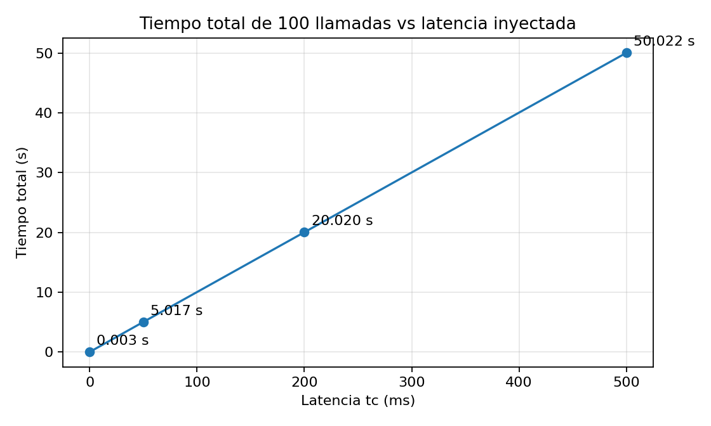

# Informe breve — Laboratorio N°1: midiendo las falacias

## 1. Entorno y método

El laboratorio se realizó en un equipo con **Fedora Linux**, utilizando **Docker Engine y Docker Compose**. Se levantaron dos contenedores, `cliente` y `servidor`, conectados mediante la red Docker `sd_net`. No fue necesario utilizar el Plan B.

Primero se midió la red sana con `ping` e `iperf3`. Luego se ejecutaron 100 llamadas secuenciales con `cliente.py`. Para estudiar el efecto de la latencia se utilizó `tc netem` sobre `eth0` del cliente, aplicando retardos de 50, 200 y 500 ms. Finalmente se reemplazó el retardo por pérdidas de 1%, 5%, 20% y 100%, midiendo nuevamente el throughput y el comportamiento del cliente. En la prueba de falla total también se ejecutó el cliente con `TIMEOUT_S=3`.

## 2. Resultados

### Línea base y latencia

| Latencia `tc` | Total (s) | Promedio (ms) | Máximo (ms) |
|---:|---:|---:|---:|
| 0 ms | 0.003 | 0.0 | 0.3 |
| 50 ms | 5.017 | 50.2 | 50.6 |
| 200 ms | 20.020 | 200.2 | 200.5 |
| 500 ms | 50.022 | 500.2 | 500.5 |

La línea base entregó un **RTT promedio de 0.050 ms** y un throughput de **38.5 Gbit/s**.



### Pérdida de paquetes

| Pérdida `tc` | Throughput iperf3 | Total cliente | Observación |
|---:|---:|---:|---|
| 1% | 11.4 Gbit/s | 0.003 s | El cliente casi no se vio afectado; máximo de 0.1 ms. |
| 5% | 462 Mbit/s | 1.453 s | Promedio 14.5 ms y máximo 210.0 ms. |
| 20% | 1.01 Mbit/s | 6.432 s | Promedio 64.3 ms y máximo 824.1 ms. |
| 100% | — | — | Sin timeout apareció `No route to host`; con `TIMEOUT_S=3`, timeout tras 3.0 s y 0 llamadas completadas. |

## 3. Observado vs esperado

Con latencia artificial, los resultados coincidieron casi exactamente con lo calculado. Como las 100 llamadas son secuenciales, con 50 ms se esperaban aproximadamente 5 s y se midieron 5.017 s; con 200 ms se esperaban 20 s y se midieron 20.020 s; y con 500 ms se esperaban 50 s y se midieron 50.022 s. Por lo tanto, en este experimento la degradación fue prácticamente **lineal con la latencia**.

En las pruebas de retardo puro, el máximo también se mantuvo muy cerca del valor inyectado: 50.6, 200.5 y 500.5 ms. En cambio, con pérdida de paquetes aparecieron picos mucho mayores. Con 5% el máximo llegó a 210.0 ms y con 20% alcanzó 824.1 ms, debido a retransmisiones y al control de congestión de TCP.

La pérdida afectó mucho más a `iperf3`: desde 38.5 Gbit/s sin pérdida bajó a 11.4 Gbit/s con 1%, 462 Mbit/s con 5% y cerca de 1 Mbit/s con 20%. La prueba de 100% fue el principal resultado distinto a lo esperado: sin timeout el cliente no quedó esperando indefinidamente, sino que Fedora terminó devolviendo `[Errno 113] No route to host`. Con un timeout explícito de 3 segundos, el comportamiento sí fue controlado y terminó después del tiempo indicado.

No se modificó la configuración del servidor durante estas pruebas; las condiciones de red fueron inyectadas en la interfaz de salida del cliente.

## 4. La falacia que asumimos

La principal falacia presente en `cliente.py` es **“la red es confiable”**. El programa supone que, una vez establecida la conexión, la respuesta del servidor terminará llegando.

Esto se observa especialmente en la **línea 17**:

```python
TIMEOUT = float(os.getenv("TIMEOUT_S", "0")) or None
```

El valor por defecto `0` se transforma en `None`, es decir, el cliente queda sin un tiempo máximo de espera. La consecuencia se aprecia en la **línea 29**:

```python
respuesta = f.readline()
```

En ese punto el cliente espera la respuesta de la red. Si la red falla y el sistema operativo no informa el error inmediatamente, esa espera podría prolongarse indefinidamente.

Una corrección simple sería usar un timeout real por defecto, por ejemplo:

```python
TIMEOUT = float(os.getenv("TIMEOUT_S", "3"))
```

y mantener el manejo de `socket.timeout` que ya existe. En una aplicación real también debería definirse qué hacer después del timeout: informar el error, reintentar de forma limitada o cancelar la operación.

## 5. Relación con la investigación

La aplicación investigada para la Evaluación 1 es **Emilia/Emilia360**, un sistema web que depende de comunicaciones entre clientes, backend y servicios de datos, además de utilizar SignalR para comunicación en tiempo real. En este contexto, la falacia **“la red es confiable”** también es relevante: una desconexión, retraso o pérdida de conectividad puede interrumpir solicitudes o conexiones SignalR aunque todos los componentes del sistema estén funcionando correctamente.

El laboratorio demuestra que no basta con asumir que una operación remota terminará respondiendo. En Emilia, este tipo de falla debe manejarse con timeouts, detección de desconexiones y mecanismos controlados de reconexión o reintento. De esta forma, una falla de red deja de transformarse en una espera indefinida o en un comportamiento difícil de interpretar para el usuario.
